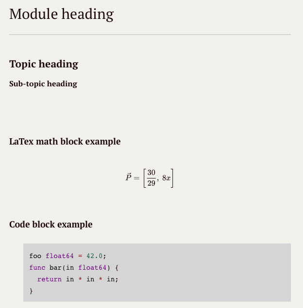

## Credits
 - Big thanks to Lecturer at NTNU Gjøvik, Bernt Tore Jensen, for beiing responsible for the curriculum presented here.

## Mission
- Create a "to the point" kompendium, which covers all topics in the Mathematics for Programming IMT 1121 - spring 2017 NTNU Gjøvik
- The kompendium should written in such a way that it will be a useful tool to bring on the exam.
- Every topic should have a practical example with inline code and/or math - blocks.

## Recomended editors

- [**Atom**](https://atom.io) - built in add-on for rendering markdown, no LaTex support.

- [**Typora**]( https://typora.io) - A Desktop GUI editor for Markdown + inline LaTex support.

- [**StackEdit**](https://stackedit.io) - A Web-based Markdown editor + inline LaTex support.

  ​

*Image: Example of the Typora environment*
